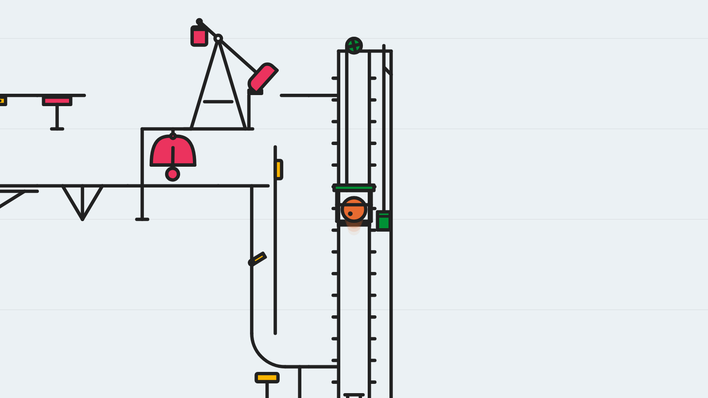
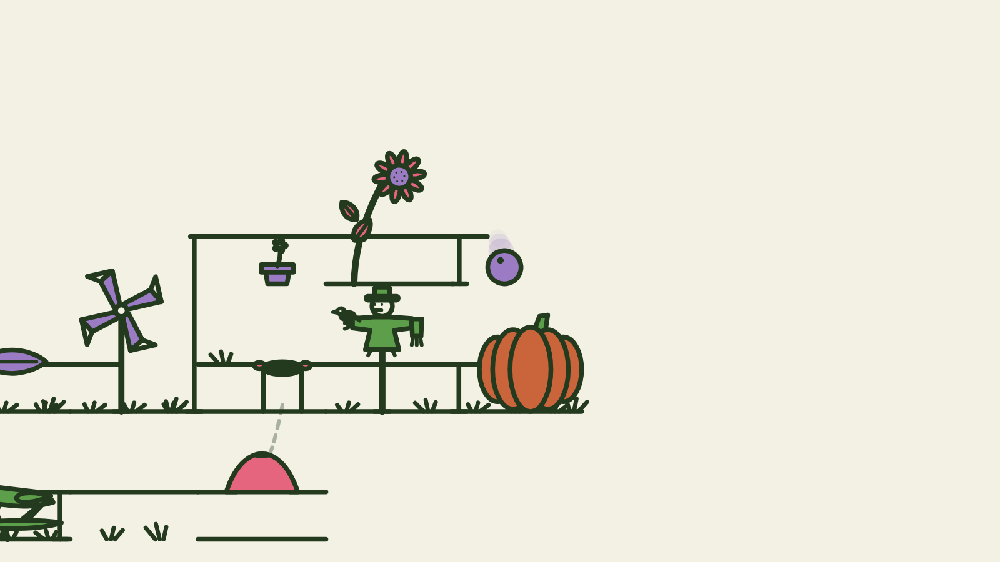
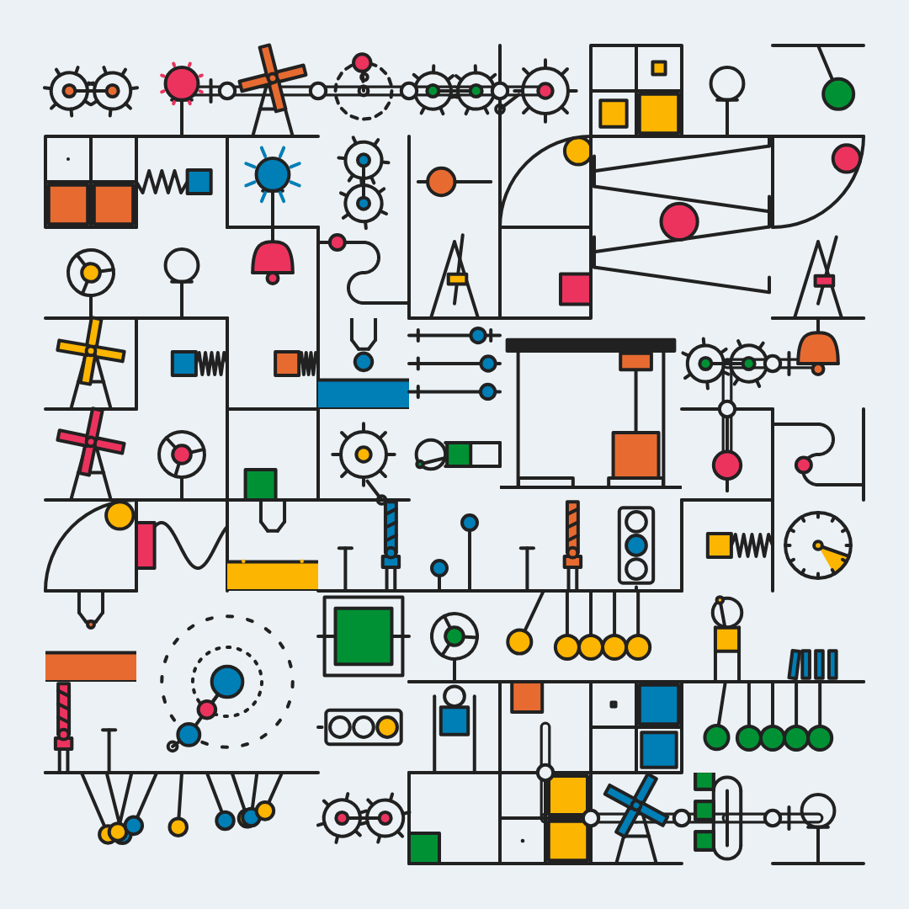

# contraptions

Small animated machines.

[Machine](https://contraptions-wustep.vercel.app/) is the front door. One ball runs a Rube Goldberg chain that never ends, and the camera follows it. At the end of a map the ball hits a portal, and the next map is a different place: new pieces, a new palette.

[Explorations](https://contraptions-wustep.vercel.app/explorations/) is the generator Machine grew out of. It fills a grid with tiny machines that loop on their own. Every control is in the URL, so a frame you like is a link you can share. Heavily inspired by [Okazz](https://x.com/okazz_/status/2090999902805393607).

## Machine

The chain visits four worlds, always in the same order: Regular, Forest, Aqua, Arcade, then back to Regular. Regular is a workshop, Forest a garden, Aqua a harbor, and Arcade an arcade. Each world has its own pieces. A seed chooses the palette, which pieces show up, and how the map is laid out.





## Explorations



There are six modes. Classic is a field of separate machines, wired together. Ports, Tracks, Cascade, Workshop, and Circus each build a different kind of grid. The panel is the same one Machine uses.

## Shows and Playground

[Shows](https://contraptions-wustep.vercel.app/shows/) is Machine set to music. A chain is choreographed to a piece, the soundtrack stays locked to the picture, and you can keep as many takes as you want side by side.

[Playground](https://contraptions-wustep.vercel.app/playground/) is where pieces and worlds wait to be let into Machine: new ones, ones that were cut, and worlds that are not in the loop yet. You can watch them the way Machine would.

The Builder is in the repo, but it is hidden for now. It is not ready.

## Run it

Node 22.

```bash
npm install
npm run dev
npm run build
```

`npm run dev` serves Machine at [http://localhost:8791/machine/](http://localhost:8791/machine/). `/` redirects there and keeps the query. Explorations is at `/explorations/`, Shows at `/shows/`, and Playground at `/playground/`.

`npm run build` writes one `dist/` with the same paths. One Vite app serves every mode, in dev and in the build.

Old links still work. `/sandbox/` redirects to Explorations and `/rube/` redirects to Machine, both keeping the seed.

## Where things are

```
machine/, explorations/, shows/, playground/, builder/   one page per mode (index.html, sandbox/ and rube/ only redirect)
src/                          Explorations, and what every mode shares
  core/  contraptions/  worlds/  ui/
apps/rube/                    Machine, and the modes built on it
  src/pieces/                 the pieces, a folder per world
  src/shows/                  Shows: player, soundtrack, share cards; STOCK_SHOWS_PLAN.md, REVIEW_STATUS.md
    versions/<work>/          one piece of music: its takes (*.show.ts), recording, attribution and write-ups
  src/playground/             pieces and worlds waiting to be let in; REJECTED.md
  src/builder/                the Builder (hidden)
  builds/                     the Builder's shipped builds
  checks/                     headless checks, run by npm run build
scripts/                      Explorations' check, and new-contraption
  shows/                      arrangements, onset measurements, audio mixes, share cards
    plans/                    piece orders and measured onsets the shows are built from
public/                       share cards and other files served at the root
```

Each show's notes live beside it, in `apps/rube/src/shows/versions/<work>/`. The recordings there are for private demos only; see each `ATTRIBUTION.txt`.

## License

Released under the [MIT License](LICENSE). Copyright Stephen Wu, 2026.
