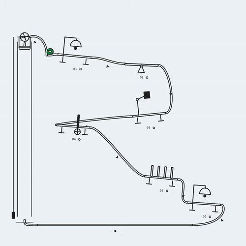
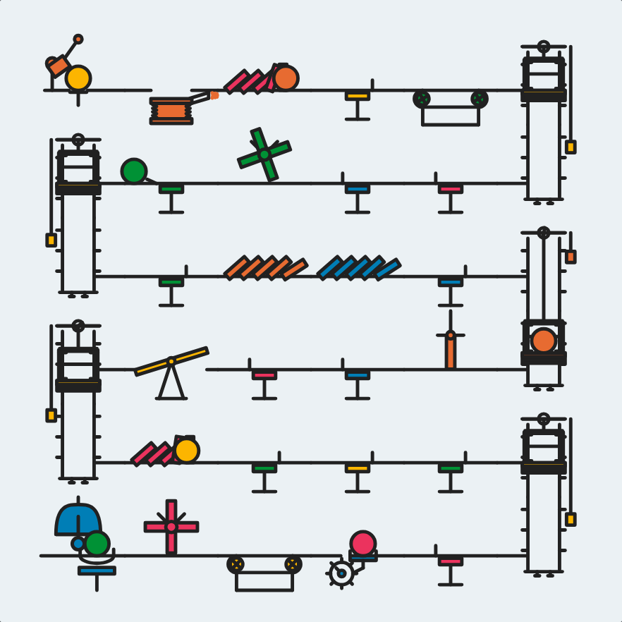
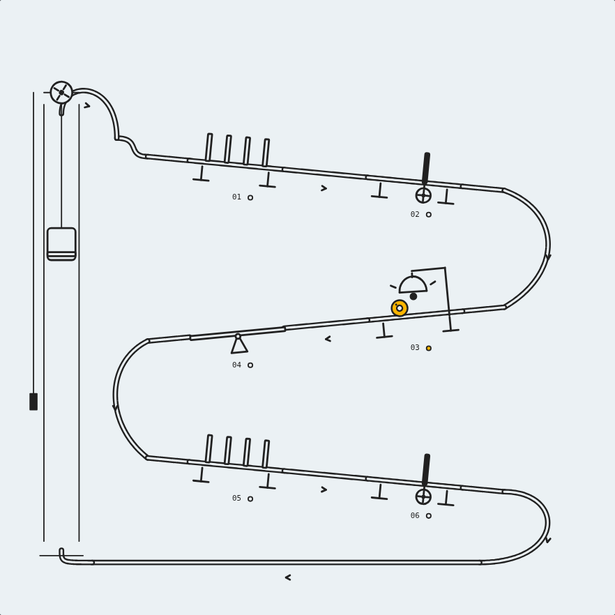
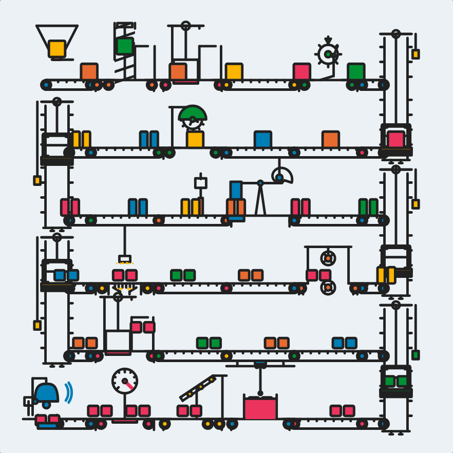
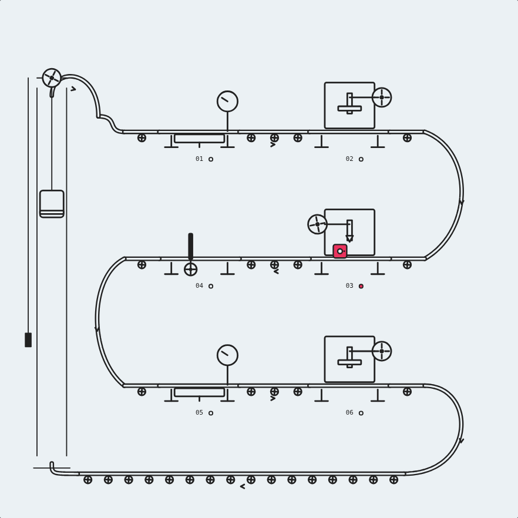
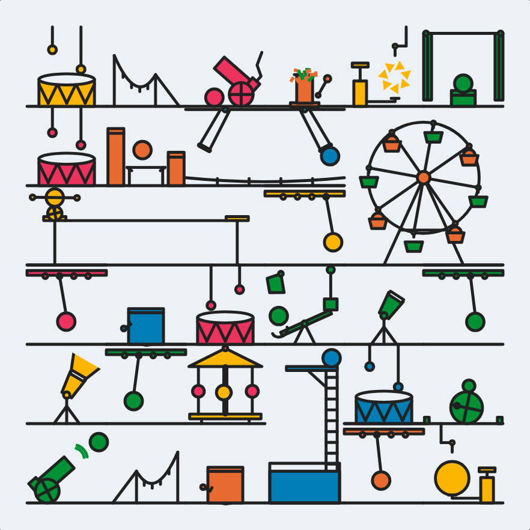
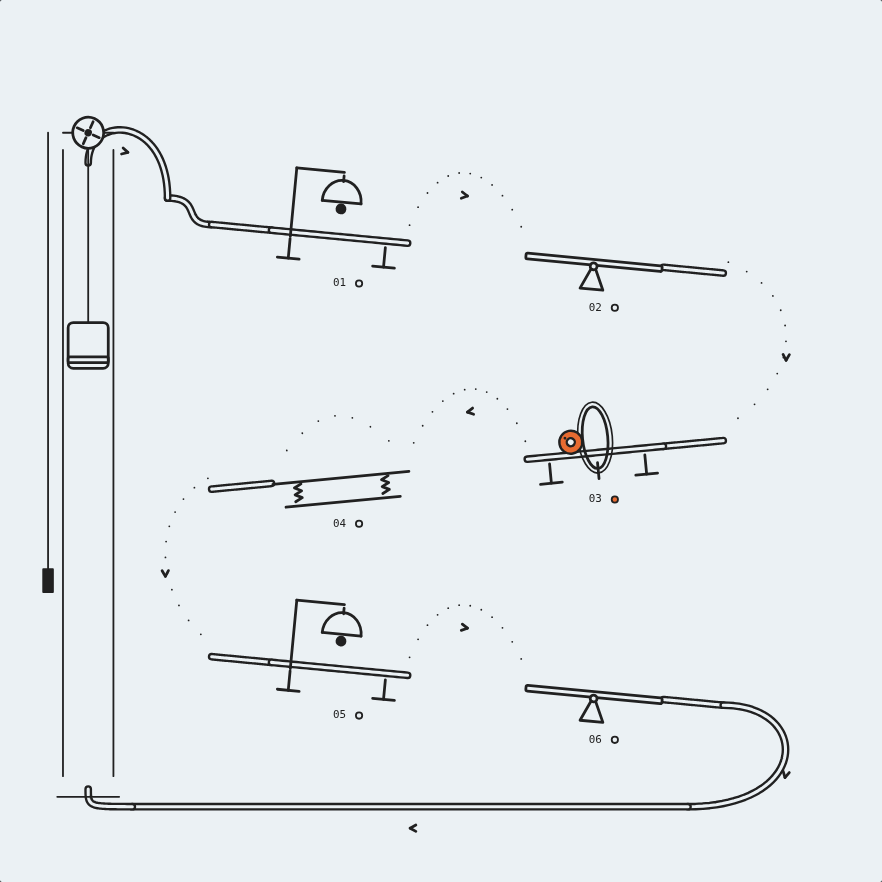
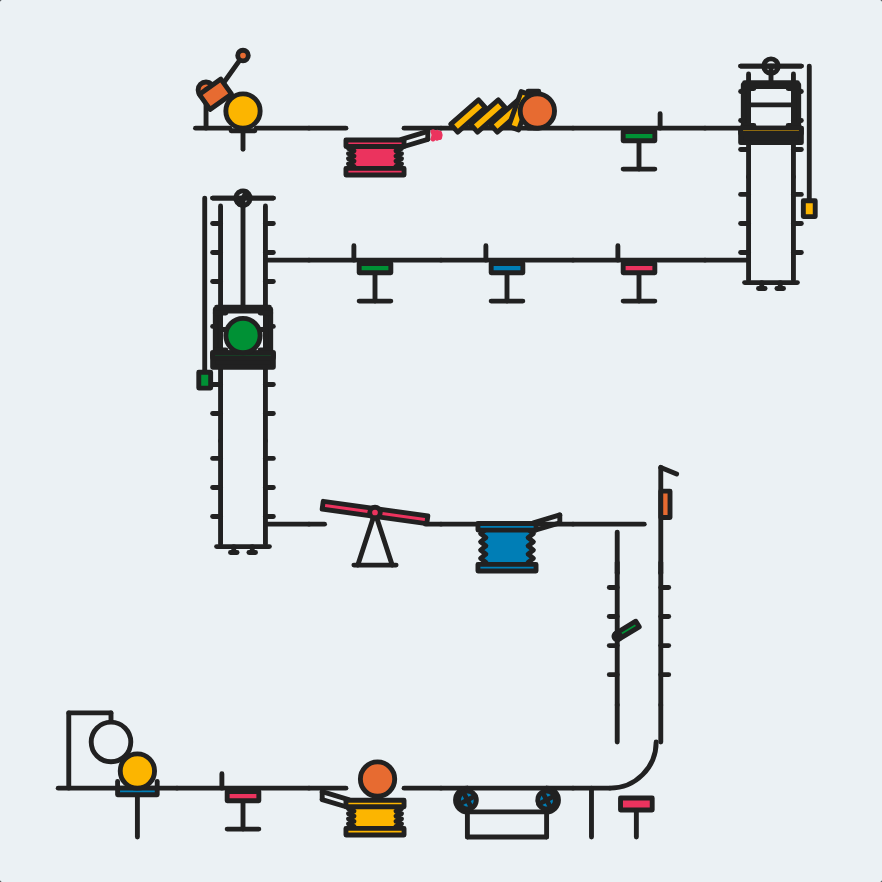
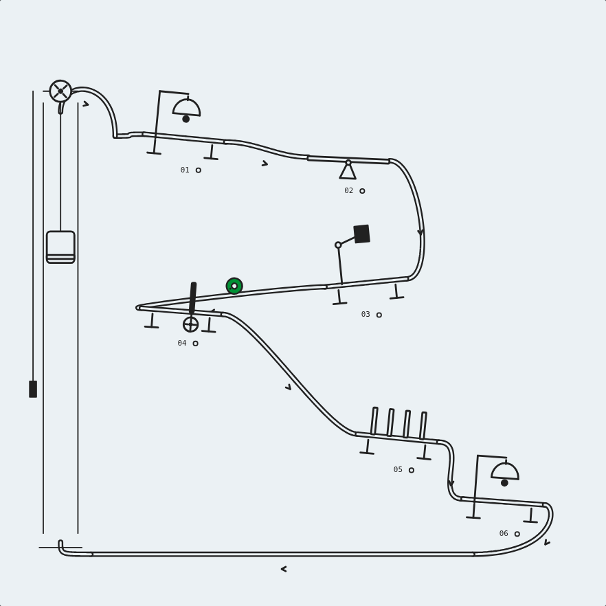

# One traveler, one machine

The live Goldberg modes now use four to eight large stops and one permanent
traveler. Shared rails or flight paths connect every stop, and an exposed lift
returns the same traveler to the start. The complete circuit takes 12 seconds.

Same mode, seed `first-look`, `res=6`, Okazz theme, paused at 28% of the loop.
Before is main (`738be3e`); after is the connected composer. The old `res=6`
meant six grid columns; it now means six working stops.

| Mode | Before | After |
| --- | --- | --- |
| Cascade |  |  |
| Workshop |  |  |
| Circus |  |  |
| Rube |  |  |

## Deliberate cuts

- Live compositions use a small set of mechanisms with explicit contact and
  release timing. The older collections remain in Catalog.
- Solo/Tag, density, span and Wander controls are retired in these four modes.
  Stops is the remaining composition control. Every stop is always connected.
- There is one traveler instead of a repeating stream of emissions. Its color,
  shape and inset/pin stay the same through tools, flights and the return lift.
  Workshop no longer recolors, splits or replaces its part.
- Old mode/seed/theme links remain usable, but generate new artwork. `res` is
  clamped to 4–8 stops; obsolete Solo/Tag filters are cleared. The other modes
  retain their original composition controls.

## Validation

- `npm run check && npm run build` passed; Vite reports the existing bundle-size warning.
- Headless Chrome checked all four modes: exact canvas pixels at 0%/100%,
  deterministic backward scrubbing, pause/play, downloaded PNGs and WebMs,
  and restoration of the frame after recording.
- Exported WebM packet timestamps cover the full 12-second circuit. The GIF
  above is a reduced-size, 15fps preview of the actual Rube export.
- Checked 4/8 stops, legacy Solo/Tag URLs, Catalog, and a 390px mobile viewport.
- Route checks cover three seeds, all stop counts, 360/900px scaling, every
  palette, fractional/negative clocks, seam continuity, full traveler bounds,
  actual rendered body count/color, and the drawn lift carrying its passenger.
