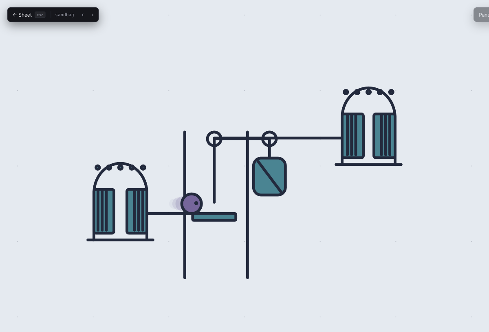
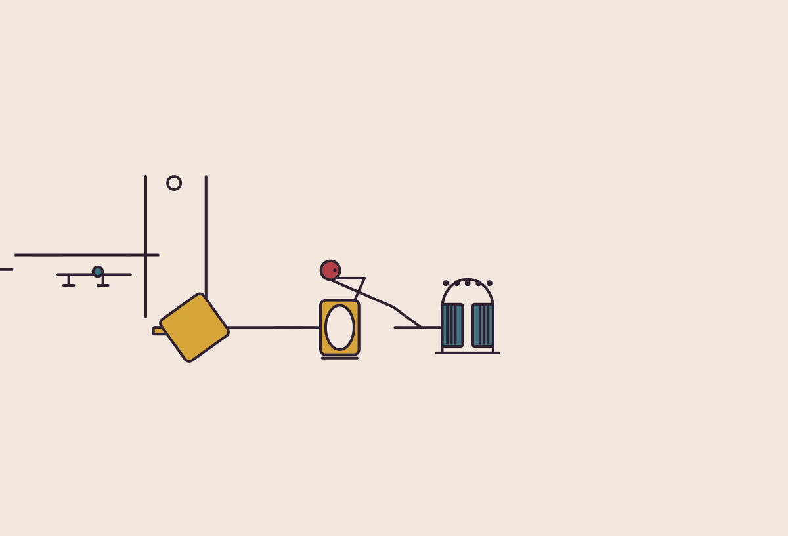
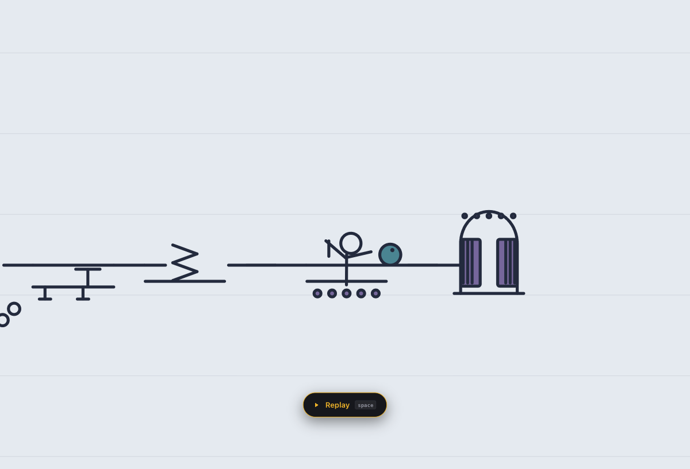

# Sol one-shot: GPT-6 Sol xhigh

The ball is the only performer. It leaves the kitchen pass, survives an opera
supper, and runs into the wings as the overture gathers speed. No second ball
appears without a job, so this take keeps one visible thread throughout.

## The two worlds

Kitchen uses enamel, tile and copper. A colander drops a ball to the next
counter; a kettle launches it above the pantry; a rolling pin stamps on a new
colour; a dish rack sends it back through its own lane. Eighteen new pieces
share the kitchen's own shuttered pass and counter track.

Backstage uses boards, ropes, work lamps and velvet. A sandbag falls as the
ball rises, a false door sends it back behind a flat, and a prop cannon makes
the ball miss its mark upward. Its eighteen new pieces share a curtained wing
and a sprung board track. Neither world uses an existing piece asset.

I sketched other gags that did not earn a place. A chorus of balls at the
curtain had no distinct roles. A soup splash and confetti burst were effects
with no physical handoff. A second rolling pin, another trapdoor, and a plain
conveyor only repeated beats already present. The shelves keep the clearer
cause and effect jokes.

## Carmen Prelude

The 125 second Musopen recording changes texture at 29.304, 44.8, 60.7,
84.614 and 101.7 seconds. Those times change the world and camera framing.
The machine's natural clock bends gently between them. Selected fires
land on measured attacks in `scripts/show-plans/carmen-sol-onsets.json`.
Strikes include the pan, prop cannon, falling sandbag, stage spring and pit.
The 60.7 to 84.614 second passage opens the camera before the finale closes
in again. The last backstage map places a curtain call at its exit and holds
that bow through the final chord.

The recording is CC0. [Source and license](../promo/carmen-prelude-license.md).

Open `/playground/?world=sol-kitchen`, `/playground/?world=sol-backstage`, or
`/shows/?show=carmen-prelude&take=sol-one-shot` in the Vite app.
