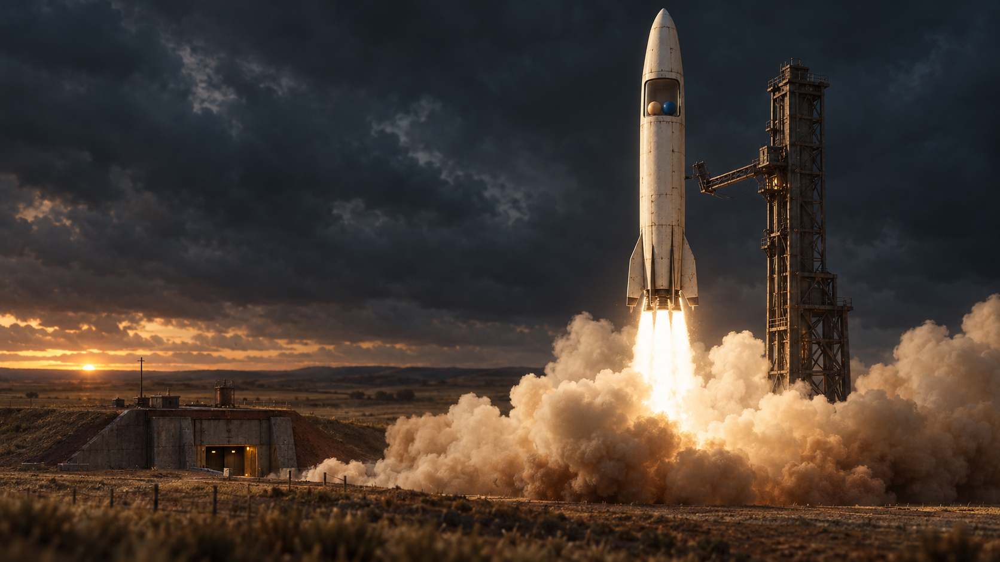
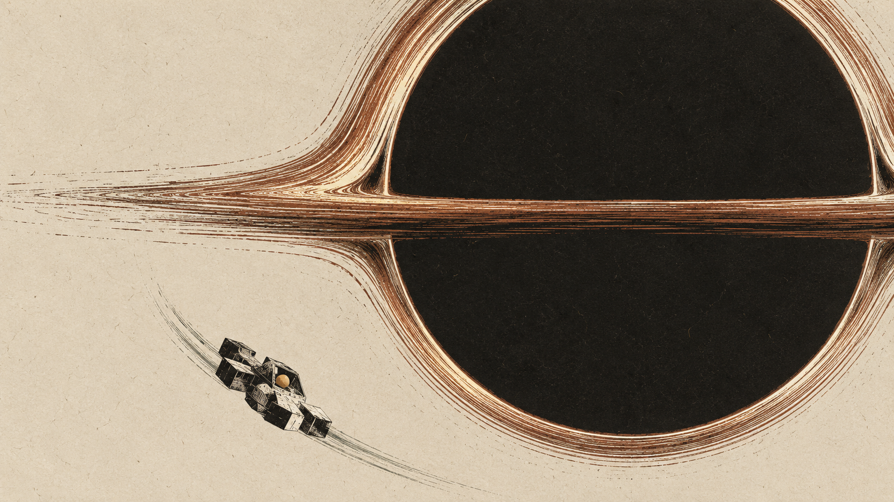
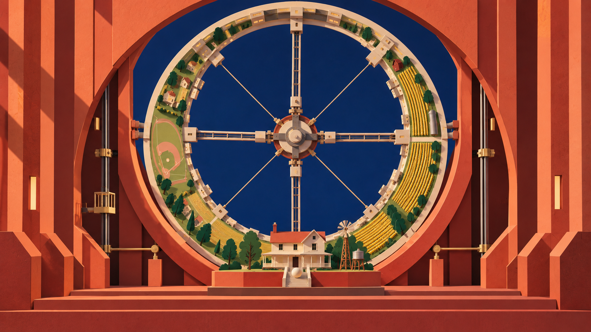
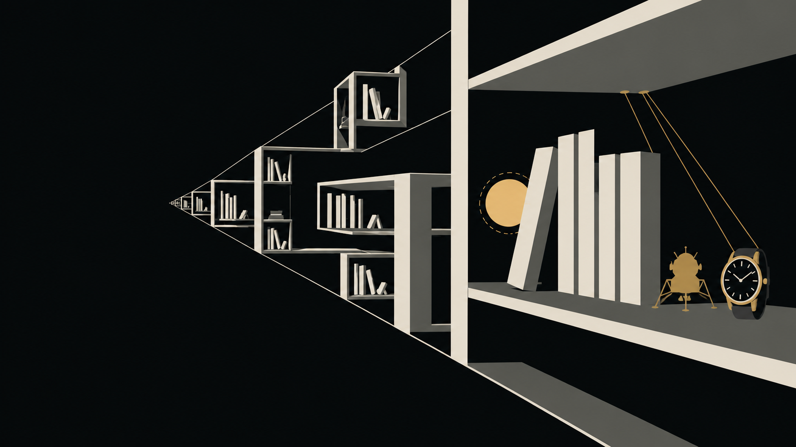
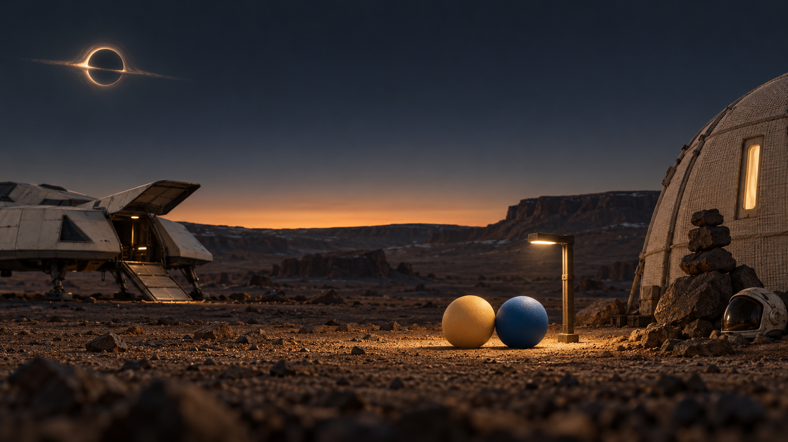

# Voyage · after Interstellar — redesign directions

**Decision requested:** Stephen chooses one visual and narrative direction, then explicitly authorizes a separate big-redesign craft PR. **Recommendation: 01 — The Weight of Light.** No direction has been approved.

**Scope of this PR: exploration only. Out of scope this PR: no craft rewrite.** This folder contains one brief and five generated concept PNGs. It changes no show code, liftoff craft, props, score map, audio, take, checks, or live page. Do not merge automatically. The redesign → fidelity → polish pipeline below does not auto-chain.

## Look first

Each image explores a different representative beat; these are original redesign concepts, not screenshots of `opus55`. Image 05 is a second scene for direction 01. Compare the treatment of space, materials, and attention, rather than the spectacle of different scenes.

| Pick | Direction | Short-film idea | Concept |
| --- | --- | --- | --- |
| **01 · recommended** | **The Weight of Light** | Fragile, tangible things carry us across immense distances. | [Launch](01-the-weight-of-light.png) |
| 02 | An Atlas of Absence | The journey is measured by the space between things. | [Gargantua](02-an-atlas-of-absence.png) |
| 03 | The Infinite Stage | A world visibly built to move becomes a home. | [Cooper Station](03-the-infinite-stage.png) |
| 04 | Gravity, Written | A physical action becomes a message across time. | [Tesseract](04-gravity-written.png) |
| 01 · variant | The Weight of Light — The Small Light | After the cosmic scale, two lives fit inside one pool of light. | [Edmunds](05-the-weight-of-light-edmunds.png) |

## Current-state snapshot

Grounded at `5d6e9929` on `explore/voyage-redesign-directions`, starting from main, reviewed 2026-10-01. [Voyage / opus55](https://contraptions-wustep.vercel.app/shows/?show=interstellar&take=opus55) is the sole registered Interstellar take in this checkout: a 291-second scored Rube Goldberg journey, using *Cornfield Chase* then *No Time for Caution*. Four timed worlds carry the farm, space, Cooper Station, and the outside journey. Warm dust-colored surfaces and dark ink invert to bone lines on navy in space; the authored camera follows mechanisms, reveals scale, and rolls with the station for the reunion. The bookcase, tin truck, pickup, combine, rocket, twelve-module Endurance, spherical wormhole, Ranger, watch, and camp are narrative machinery, not interchangeable scenery.

Recent context: [Astra detail polish #145](https://github.com/wustep/contraptions/pull/145) is merged and improves lighting, framing, atmosphere, and landing readability. [Opus frame-scrub #148](https://github.com/wustep/contraptions/pull/148) is open; its worktree at `c8d20600` refines edges, haze, tesseract depth, motion, and young Murph's color. These are passes on the same take, not alternative redesigns. This exploration does not continue or import either craft pass. No PRODUCT, DESIGN, or `.impeccable` notes were found in this checkout. Grounding used the canon, score, camera, representative scene code, checks, PR history, and the checked-in share still. Optional live scrubbing was attempted, but browser startup failed; no fresh playback audit is claimed.

### Shared story and score contract

All four directions retain the following unless Stephen explicitly approves a named departure in the future redesign brief:

- **The cast and agency:** sand Cooper (`#F0C987`) drives the chain; deep-blue Brand (`#1F5E98`) first joins at NASA, rides with him, is separated at the trapdoor, and waits in orbit over Miller. Old Murph is slate (`#7C8C9C`), meets him on Cooper Station, and sends him onward. Brand remains blue. TARS remains four articulated dark slabs, first encountered at NASA. Keep the cast as simple balls with timing and position for performance.
- **The story:** the farm and drive; launch; Endurance and separation; Miller's unequal passage of time; the Ranger's Gargantua slingshot; the tesseract's opening-book callback and watch message; the wake; the station journey and Murph reunion; undock, Saturn, wormhole, landing, and Brand reunion. Both reunions must read as different relationships.
- **The scored continuity:** preserve the existing measured strikes, beat ownership, scene order, and transition mechanisms. Anchors include ignition at ~83.76 s, the cloud concealment at ~88.8 s, the Miller whip at ~103.8 s, the book/watch/bed sequence before the station accent at ~127.51 s, Ranger match cut at ~207.50 s, and the wormhole passage at ~235.50 s. Touchdown remains ~251.49 s and the final lamp hit ~255.49 s; the audio endpoint is 262.741 s and the show ends at 291 s. These are grounding anchors, not a rewritten score.
- **The medium's promises:** contact causes an event; the camera makes the contact readable; no teleportation, duplicate cast, parallel hero lanes, or new portal transitions. Keep the wordless picture and the existing end-credit interval over the camp. Ball-color accents are reserved for characters; scenery should not create apparent extra cast.

**Existing canon drift to resolve at the redesign gate:** [INTERSTELLAR.md](../../apps/rube/src/shows/versions/interstellar/INTERSTELLAR.md) says Murph appears only on the station, while current [worlds.ts](../../apps/rube/src/shows/versions/interstellar/liftoff/worlds.ts), Earth scenes, and [show checks](../../apps/rube/checks/shows.ts) include young Murph on the farm and at the base. PR #148 already flags this discrepancy. These directions use the requested locked written cast/story contract; none proposes adding or removing young Murph. All five stills avoid that disputed interval. Stephen must settle the intended baseline before any redesign code is authorized. Historical timing and prop notes in the canon also describe superseded passes; use the current score/code to establish exact production timing at that gate, without silently editing canon now.

## 01 — The Weight of Light



*Concept 01 — launch, approximately 84–85 s. Choose this for tactile weight, a legible shared cockpit, and the move from a lived-in Earth to overwhelming space.*

**Thesis.** Build Voyage as a film of small, tangible things carrying enormous consequences. Wood holds a room together; a latch carries a body; a thin hull crosses a void; a lamp makes somewhere habitable. Give every place a coherent material construction and make the frame alternate between intimate contact and tremendous distance. The narrative emphasis becomes leaving, waiting, returning, and choosing to leave again. Cosmic spectacle earns its scale through the fragility of what crosses it.

**Palette and materials.** Bone `#D8D0BE`, umber `#6B4936`, charcoal `#171C22`, muted sage `#68715A`, with localized gold light. Stained wood and worn tin on Earth; dull enamel, folded foil, and cut metal in space; familiar wood rebuilt with unsettling precision on the station; woven shelter and stone at Edmunds. Cast hues stay fixed and readable through all lighting. Each scene gets one dominant light source and a clear shadow hierarchy.

**Motion and camera.** Continuous weighted motion: hinges load before release, bodies settle after contact, exhaust presses against surfaces. Keep exact impact times; change the design of anticipation, recovery, and framing around them. Use lateral tracking at mechanism height on Earth, measured vertical disclosure at launch, broad negative-space compositions in orbit, and a low intimate frame for each reunion. Depth comes from a few separated planes, deliberate overlap, and perspective; no focus effect may hide the next contact. Preserve the authored cuts and station roll.

**The whole journey.** The farm feels handled and repaired. The rocket is a thin vessel escaping that familiar weight. On Miller, a shallow reflective plane and distant wave make Cooper vulnerable while Brand's orbit remains distinctly readable. Gargantua becomes a concentrated blade of light against deep black. The tesseract repeats actual room construction into impossible depth, making the return to a pillow feel physical. Cooper Station reuses the farm's materials too perfectly, turning home into a preserved object. Murph's worn chair breaks that museum stillness. Edmunds finally offers a modest place that can be lived in.

**What stays / what changes.** The complete shared contract stays. Redesign the spatial layout, object silhouettes, material system, lighting logic, backgrounds, and camera compositions throughout the show; retain each mechanism's narrative function and scored hand-off. This is a full restaging, not another haze, outline, or prop-detail pass. No narrative reframe beyond shifting visual emphasis toward shelter and separation.

**Risks.** Highest fidelity cost of the four. A beautiful raster could tempt an unproven renderer change, expensive lighting, or scenery that hides the machine. Toy-scale materials could become cute. Dark blue Brand could disappear in shadow. The later redesign must establish a feasible moving version with readable silhouettes before pursuing surface richness; this session makes no performance claim.

**Why “after Interstellar.”** It honors the film's domestic objects, physical scale, and emotional return while giving the short its own handmade material world. The relationship between a small body, a useful object, and a vast space can communicate even without recognizing the film's machinery.

## 02 — An Atlas of Absence



*Concept 02 — Gargantua, approximately 115–117 s. Choose this for graphic distance, printmaking, and a deliberately sparse emotional register.*

**Thesis.** Tell the journey through what is missing from the frame. Earth begins dense with marks of use; each departure opens more untouched space around Cooper. Time leaves traces in the environment while characters retain their identity. The two reunions briefly close those distances. Voyage becomes an animated print about absence, duration, and the effort required to cross a gap.

**Palette and materials.** Warm paper `#E9DFCB`, near-black ink `#20221E`, copper `#A35B3E`, muted sage-grey `#748174`; preserve the three character colors as intentional exceptions to the limited inks. Use carved contours, selective hatch fields, and large unprinted areas. Texture belongs to stable surfaces, with clean paper immediately around contacts. No geographical labels or explanatory typography.

**Motion and camera.** A steady drawing carries smoothly moving mechanisms; avoid flickering line boil or stepped playback that shifts strikes. Horizontal travel dominates Earth, arcs dominate space, and gaps carry the sensation of waiting. Compose long lateral moves and measured pulls into blank paper, keeping Cooper and the next mechanism connected in the frame. At existing transitions, ink density and negative space change inside the same cloud, sphere, room, and ship matches; there are no new page-turn cuts.

**The whole journey.** Farm rows become deep printed furrows; the launch flame carves a pale vertical opening. Miller is almost blank horizontal paper, with Brand's orbital tally forming a compact separate register of elapsed time. Gargantua is one massive ink weight. The tesseract becomes an impossible arrangement of printed room sections, with the original books still recognizable. The station is a precise circular engraving enclosing familiar domestic marks. At Edmunds, the small lamp's copper pool interrupts the otherwise sparse landscape.

**What stays / what changes.** Keep cast, sequence, mechanisms, score, and both reunions. Replace the current illustrated surfaces with a unified print language, simplify peripheral scenic density, and redesign the frame around distance rather than an evenly detailed world. Objects retain recognizable silhouettes; the watch stays a watch, the Ranger a vessel, and TARS four slabs.

**Risks.** Hatching may shimmer in motion or vanish on a phone. The film could feel emotionally remote, or become a collection of attractive plates. Thin lines can weaken collisions. This is not a factual cartographic account: its space is expressive, while routes, contact, and clock remain literal. No plot change is proposed.

**Why “after Interstellar.”** It turns the film's separation and lost time into an independent printmaking language. The image can feel like something remembered after watching, rather than a miniature reconstruction of a famous shot.

## 03 — The Infinite Stage



*Concept 03 — station reveal, approximately 133–137 s. Choose this for visible construction, color, and a world staged as a mechanical performance.*

**Thesis.** Make the entire voyage a constructed stage whose scenery participates in the action. The farm is a working set; space is made from enormous planes and suspended forms; Cooper Station reveals that a landscape can itself be a moving machine. The same cast travels continuously through it. The emotional turn comes when all that visible apparatus makes room for two quiet encounters.

**Palette and materials.** Ultramarine `#263F78`, coral `#C76850`, clay red `#AE493E`, apricot `#E9B67B`, and cream `#EEE0C1`. Layered card, painted plywood, folded metal, taut thread, and crisp theatrical shadows. Distinguish the blue scenery from Brand through value, surrounding cream, and her unchanged deep-blue hue. Decoration is architectural; a hinge or rod must explain something.

**Motion and camera.** Broad scenery moves in sustained phrase-length gestures; local mechanisms articulate the exact strikes. Smooth motion stays on the existing clock, even when the material suggests stop-motion. Favor frontal compositions and shallow lateral travel, with controlled pushes through nested flats. The station's scored camera roll remains: the far-side house comes upright for Murph. Keep the camera close for performance, so the cast does not become a tiny ornament inside the set.

**The whole journey.** The farm's rooms and corn are layered wings. Launch drives a tall ivory form through folded cloud planes at the existing concealment. Miller is a reflective horizontal stage with a wave formed from a rising wall. Gargantua is a huge black disc whose physically separated luminous arcs occlude correctly. Tesseract rooms are nested stage boxes rotated in depth. On the station, familiar farmland occupies the inside of a wheel. Edmunds resolves the large moving scenery into a small shelter and one steady light.

**What stays / what changes.** Keep the full story, the one causally connected route, score, and transitions. Rebuild every setting and prop family around visible stage construction and a common scale of joints and thicknesses. Sets can move within a world, but the farm-to-space hand-off still happens inside the cloud and the station exit still matches on the Ranger.

**Risks.** Theatrical charm may soften grief or make danger feel decorative. A busy set can compete with its actors. **Deliberate presentation reframe:** scenery openly reads as constructed theater. This does not make the story a dream or a museum performance, and introduces no narrator or audience; if Stephen wants literal worlds throughout, reject this direction. Unmotivated scene swaps would violate the continuity contract.

**Why “after Interstellar.”** It translates the film into mechanical theater, using the pleasure of visible artifice that already belongs to Contraptions. The independent idea is that building and operating a world is itself an act of care.

## 04 — Gravity, Written



*Concept 04 — the tesseract callback, approximately 120 s. Choose this for abstraction, exact relationships, and the strongest departure from scenic illustration.*

**Thesis.** Reduce Voyage to bodies, constraints, and messages. A ball loads a lever; a lever changes a route; a route separates two lives; the hand of a watch transmits an action back across time. The story's shape emerges from repeated physical relationships. Instead of asking how closely a world resembles the film, ask how clearly the picture can express an action and its consequence.

**Palette and materials.** Near-black `#080B0D`, ivory `#DDDCD3`, flat grey `#656761`, restrained gold `#B7975B`, and the locked cast hues. Hard planar shapes, a small hierarchy of line weights, and almost no surface texture. Depth is expressed through scale and occlusion. Gold connects the watch's existing message; it does not become a decorative path drawn behind every ball.

**Motion and camera.** Contact changes one clearly visible state: a plane tilts, a latch releases, a line tensions. Reserve pauses for existing holds; do not remove strikes to achieve minimalism. Camera motion emphasizes axes, scale ratios, and the frame's orientation. A room can expand into an architecture of repeated rectangles, but only within the existing tesseract interval. The station roll and Ranger match cut preserve their literal spatial purpose.

**The whole journey.** The farm retains the bookcase, toy, truck, combine, and gate as unmistakable functional silhouettes. Launch pits a slim vertical vessel against a broad cloud plane. Miller's horizontal water and Brand's rapid orbital circle become two simultaneous clocks. Gargantua bends that geometric order around a single black center. The tesseract reveals the shelf as a repeated temporal structure. The station makes one complete circle habitable; Murph's small chair and gesture interrupt its symmetry. Edmunds reduces the ending to two colored bodies, a shelter, and a light.

**What stays / what changes.** Retain all shared story and timing. Radically simplify prop design, scenery, spatial hierarchy, and visual response, while keeping every necessary contact and transport leg understandable. The characters stay characters, not chart markers. Familiar objects are the semantic anchors; the machine remains physically causal.

**Risks.** Greatest risk to narrative recognition and emotional warmth. Over-reduction could make NASA, Miller, or the two reunions indistinct, and colored circles could look like an abstract visualizer. **Deliberate narrative emphasis reframe:** the foreground subject becomes causality and communication. No event is reordered or removed, but choosing this direction means accepting a less literal depiction of place. If a simplification cannot preserve an essential beat, retain the recognizable object rather than silently cutting the beat.

**Why “after Interstellar.”** It responds to the film's proposition that a physical signal can connect lives across time. It can stand as its own wordless short about action, distance, and response, with the bookshelf and watch providing concrete emotional anchors.

## Recommended pick — 01, The Weight of Light

Choose **The Weight of Light** for the first complete redesign. It offers the strongest balance of distinct authorship, immediately readable mechanical action, and an emotional range that includes both cosmic scale and small domestic gestures. Its major change is structural: material systems, depth, spatial staging, and the way the camera assigns importance across the entire film. It has no need to alter the plot or score to feel like a new work.

The launch and ending deliberately test opposite needs. In image 01, the window keeps two travelers present inside the spectacle. In image 05, the travelers become the subject and the cosmic world recedes. That relationship is a useful governing rule for the whole redesign: **spend visual complexity on what the characters touch; let distance simplify everything else.** It also gives Earth, the station replica, and Brand's camp related but meaningfully different kinds of home.

The cost is a more demanding translation from concept art to an animated renderer. Approval should select the material and cinematic principles, not promise photographic rendering or authorize a new engine. If Stephen values a stronger graphic departure over tactile warmth, choose Atlas; for visible mechanical theater, Stage; for radical abstraction, Gravity. Do not blend the four into a compromise before a direction is chosen.



*Concept 05 — Edmunds after the greeting, approximately 258 s. A strong variant of direction 01, not a fifth direction. The frame proposes the final emotional scale; exact cast spacing and credit composition remain production staging constraints.*

## Gated pipeline — Stephen approves every gate

**Current stopping point: directions + five images + this PR.** Publishing or merging this exploration is not authorization to execute it. No redesign, fidelity work, polish round, or merge starts automatically.

| Gate | Stephen's explicit approval | Work allowed only after that approval | Required stop |
| --- | --- | --- | --- |
| **1 — Big redesign** | Select one direction, settle the young-Murph baseline and any proposed narrative reframe, and authorize a separate big-redesign craft PR. | Full visual/narrative restaging within the approved contract: scene architecture, prop families, camera language, visual performance, and the complete journey. Establish feasibility and readable motion as part of that redesign. | Present the complete redesign and evidence of story, score, transition, and cast continuity. Wait for Stephen to review and approve before starting fidelity. |
| **2 — Fidelity** | Approve the big redesign and explicitly authorize the fidelity pass. | Bring its approved shapes, materials, lighting, depth, and motion into consistent execution; validate at the actual playback sizes. | Present the fidelity result. Wait for Stephen's approval before any polish round. |
| **3 — Multiple polish rounds** | Approve the previous result and explicitly authorize the next numbered round. | Address that round's agreed craft issues, with appropriate playback and regression checks. | Stop after every round. Stephen approves the previous round before the next begins. No bundled automatic rounds. |

Direction selection alone does not waive story locks. Any new change to cast, cuts, score ownership, or narrative must be identified in the future proposal and explicitly approved. Merge decisions remain separate; **do not merge this PR in this session**.

## Concept provenance and review limits

Generated with the built-in image generation tool on 2026-10-01. The five originals were generated from prose without film stills or current-take screenshots as image inputs. Images 03 and 04 each received one edit using only their own generated first version: 03 for a wider, simpler theater composition; 04 for flatter graphic treatment. Only the five selected PNGs are included here. No CLI/API fallback or HTML substitute was needed.

These images establish direction and composition. They are not exact prop drawings, an animatic, a score map, or evidence of real-time feasibility. In particular, the simplified books and watch in image 04 do not replace the ten-book Morse sequence, watch details, or callback order; the station still is not a replacement route layout; image 05 does not define exact ball spacing. Those remain governed by canon and the approved production baseline. A still cannot demonstrate impact timing, continuity, readability through motion, or the distinct performances of Murph and Brand.

Validation for this PR: inspect all five images, verify PNG integrity and local Markdown links, and confirm the entire branch diff contains only this brief and the five PNGs. No runtime tests or playback-performance claims apply to this docs-only change.

### Grounding references

- [Locked cast, story, cuts, and historical craft notes](../../apps/rube/src/shows/versions/interstellar/INTERSTELLAR.md).
- [Registered opus55 take](../../apps/rube/src/shows/versions/interstellar/opus55.show.ts), [score and scene assembly](../../apps/rube/src/shows/versions/interstellar/liftoff/score.ts), [music clock](../../apps/rube/src/shows/versions/interstellar/liftoff/music.ts), [camera](../../apps/rube/src/shows/versions/interstellar/liftoff/camera.ts), and [palettes and cast colors](../../apps/rube/src/shows/versions/interstellar/liftoff/worlds.ts).
- [Farm and bookcase](../../apps/rube/src/shows/versions/interstellar/liftoff/earth/house.ts), [launch](../../apps/rube/src/shows/versions/interstellar/liftoff/rocket.ts), [Gargantua and tesseract](../../apps/rube/src/shows/versions/interstellar/liftoff/space/gargantua.ts), [station](../../apps/rube/src/shows/versions/interstellar/liftoff/act2/station.ts), and [Edmunds](../../apps/rube/src/shows/versions/interstellar/liftoff/act2/edmunds.ts).
- [Take and route conventions](../../apps/rube/src/shows/versions/README.md), [existing share still](../../public/shows/interstellar/opus55.png), [merged Astra craft PR #145](https://github.com/wustep/contraptions/pull/145), and [open Opus craft PR #148](https://github.com/wustep/contraptions/pull/148).

### Exact generation prompts

The prompts below record the exploration, including intent that the generator approximated. The production constraints above take precedence over details in a concept raster.

<details>
<summary>01-the-weight-of-light.png — original generation prompt</summary>

```text
Use case: stylized-concept. Asset type: one original concept still for a complete redesign of Voyage, an animated mechanical short film after Interstellar. Landscape 16:9 composition, requested 1536x864 or similar wide native image. This is new art direction, not a screenshot or film frame. The cast are small simple featureless solid-colored spherical marbles, not people, with no eyes, faces, limbs or suits. Cooper is warm sand #F0C987; Brand is deep blue #1F5E98; old Murph is slate #7C8C9C. Use only characters explicitly named in this scene. Mechanical cause and effect must be legible. No typography, labels, titles, logos, watermarks, UI, decorative border or color swatch strip. No photoreal human actors.
Direction 01: THE WEIGHT OF LIGHT. A cinematic miniature set built from stained basswood, worn off-white enamel, thin aluminum and matte clay, photographed with restrained stop-motion-film tactility but clean precise silhouettes. Scene: the launch, the instant after ignition at the farm's hidden base, around 84–85 seconds. Wide low three-quarter view. A tall slim ivory rocket rises at the right half beside a weathered steel gantry; its warm inset cockpit window clearly contains exactly two small marbles, sand Cooper and blue Brand, side by side and separated. They must be visible as simple colored balls through clear glass. Real weight: hot pale exhaust presses a dense cream dust cloud outward against the pad, brown dust touching the ground, a few large smoke forms, not busy particles. Low rust-red bunker and the suggestion of distant dry farmland in the left lower third, the gantry and hinged service arm as purposeful working mechanisms. The rocket is the clear protagonist, nose around upper quarter; cast readable inside window, not giant balls. Upper half spacious almost charcoal-blue storm sky. One slit of low warm horizon light traces field ridges and rocket edge; flame illuminates the underside of smoke. Palette burnt umber #6B4936, bone #D8D0BE, charcoal #171C22, muted sage #68715A, very limited warm lamp gold. Deep convincing shadow, no pervasive bloom, no plastic toy sheen. A dramatic single production-design keyframe with a quiet broad background and only a few intensely observed surfaces. The picture should feel monumental despite the miniature materials, not cute, steampunk, diagrammatic, cartoon-outlined or generic glossy science fiction. No extra spherical lamps mistaken for cast; no other characters.
```

</details>

<details>
<summary>02-an-atlas-of-absence.png — original generation prompt</summary>

```text
Use case: stylized-concept. Asset type: one original concept still for a complete redesign of Voyage, an animated mechanical short film after Interstellar. Landscape 16:9 composition, requested 1536x864 or similar wide native image. This is new art direction, not a screenshot or film frame. The cast are small simple featureless solid-colored spherical marbles, not people, with no eyes, faces, limbs or suits. Cooper is warm sand #F0C987; Brand is deep blue #1F5E98; old Murph is slate #7C8C9C. Use only characters explicitly named in this scene. Mechanical cause and effect must be legible. No typography, labels, titles, logos, watermarks, UI, decorative border or color swatch strip. No photoreal human actors.
Direction 02: AN ATLAS OF ABSENCE. Bold fine-art animated woodcut / mezzotint / drypoint print, black printed ink on warm uncoated ivory paper. Flat graphic composition with visible paper grain, precise carved linework only in selected areas, no 3D shading, no glossy rendering, no cinematic miniature. Scene: Gargantua slingshot around 115–117 seconds. A colossal sharply defined pure-black circular void, cropped slightly at the top, dominates the right two thirds. Its horizontal accretion disk and gravitationally lensed upper and lower halo are engraved tightly in a thin warm copper ink against ivory negative space. Clearly a black hole, not Saturn: no surface bands on the black center. A tiny angular ivory Ranger sweeps along its lower-left flank, an inset cockpit containing a sand-colored Cooper marble; emphasize immense empty distance, ship small but silhouette clear. Do not add Brand or Murph. Show exactly one ship, one present-time still, no sequential duplicates and no drawn route arrows. A sparse fan of bent hatch lines suggests the disk's shear, while huge areas of paper remain untouched. The black disk has unbroken black interior; lensed light remains narrowly controlled, no star fog. Small copper accents on the hull tie it to the light, and the warm sand sphere is the only saturated cast accent. Palette paper #E9DFCB, ink #20221E, copper #A35B3E, muted grey-sage #748174. Serious, spare, emotionally lonely handmade print suitable for an experimental animated short; not a poster with text, a scientific plate with labels, or a retro sci-fi paperback illustration.
```

</details>

<details>
<summary>03-the-infinite-stage.png — original generation prompt</summary>

```text
Use case: stylized-concept. Asset type: one original concept still for a complete redesign of Voyage, an animated mechanical short film after Interstellar. Landscape 16:9 composition, requested 1536x864 or similar wide native image. This is new art direction, not a screenshot or film frame. The cast are small simple featureless solid-colored spherical marbles, not people, with no eyes, faces, limbs or suits. Cooper is warm sand #F0C987; Brand is deep blue #1F5E98; old Murph is slate #7C8C9C. Use only characters explicitly named in this scene. Mechanical cause and effect must be legible. No typography, labels, titles, logos, watermarks, UI, decorative border or color swatch strip. No photoreal human actors.
Direction 03: THE INFINITE STAGE. An original theatrical set maquette in layered cut paper, painted plywood, pigmented plaster and taut thread; frontal deep proscenium composition, expressive saturated color blocks and visible constructed edges, like an ambitious miniature mechanical opera. Scene: Cooper Station, the whole circular O'Neill-cylinder interior revealed end-on at around 135 seconds, not a space-station exterior and not an isolated ring spaceship. A complete giant circular rim of inhabited land curves around an open deep midnight-blue center: ochre corn beds on the right, a tiny baseball diamond standing sideways up the rim at left, and the replica farmhouse on a distinct museum plinth upright at the bottom. Roofs and trees rotate with the rim; every object's down points outward. Several physical spokes lead to a small mechanical hub in the center. At the bottom farmhouse threshold a single warm sand Cooper sphere, small but legible, begins to exit toward a hinged turnstile. No other cast. Front layers in coral #C76850 and clay #AE493E, inner surfaces rich ultramarine #263F78, lit edges pale apricot #E9B67B and cream #EEE0C1; no neon. A warm amber theatrical side light enters from upper left, casting graphic blade-like shadows from thick paper land terraces and louvres; the far ring falls into deep blue. Hinges, a water wheel, a lift and a few brass rods reveal how the set works, elegantly sparse rather than a pile of gears. Architectural, handmade and spatially surprising: a world built as a wheel that can be turned by the score. No curtains, spectators, humans, toy faces, labels or stage text. Keep the overall ring whole and extremely readable.
```

</details>

<details>
<summary>03-the-infinite-stage.png — final edit prompt</summary>

```text
Use case: style-transfer. Edit target: the attached Cooper Station concept still. Keep the exact subject, story, palette family, single featureless sand Cooper sphere at the lower farmhouse, and frontal circular inhabited interior with baseball field on the left and corn on the right. Preserve no text, no human characters. Make two coupled art-direction changes: pull the camera back enough that the COMPLETE station ring fits inside the landscape frame, with comfortable space above and below the outer rim; and render the entire set as bold flat painted CUT-PAPER and PLYWOOD THEATER instead of realistic miniature model photography. Each building should have visibly layered flat card walls and roof, trees as simple cut paper silhouettes, broad ultramarine and vivid coral painted planes with crisp cast shadows, plain clean surfaces without photographic grain or stone texture. A strong editorial puppet-theatre maquette, sophisticated simplified geometry, open midnight ultramarine center, no galaxy effects. No curtains. The complete circle must fit vertically with a 6% image-height margin above its outer edge. Reduce scenic density and keep the farmhouse doorway, Cooper ball, turnstile and first connecting mechanism legible. All light fixtures are rectangular slots; do not add extra spheres or anthropomorphize Cooper. Keep original landscape aspect.
```

</details>

<details>
<summary>04-gravity-written.png — original generation prompt</summary>

```text
Use case: stylized-concept. Asset type: one original concept still for a complete redesign of Voyage, an animated mechanical short film after Interstellar. Landscape 16:9 composition, requested 1536x864 or similar wide native image. This is new art direction, not a screenshot or film frame. The cast are small simple featureless solid-colored spherical marbles, not people, with no eyes, faces, limbs or suits. Cooper is warm sand #F0C987; Brand is deep blue #1F5E98; old Murph is slate #7C8C9C. Use only characters explicitly named in this scene. Mechanical cause and effect must be legible. No typography, labels, titles, logos, watermarks, UI, decorative border or color swatch strip. No photoreal human actors.
Direction 04: GRAVITY, WRITTEN. Severe geometric experimental animation, nearly monochrome, screen-printed hard edges and precise luminous line planes, with two or three solid material weights rather than illustrative textures. Scene: the tesseract bookshelf callback at around 120 seconds. One enormous black field #080B0D containing nested off-white rectangular room frames #DDDCD3 receding at strict oblique angles into a deep vanishing point. Architecture folds time through rhythm, negative space and occlusion. The nearest room occupies the right third with a single unmistakable simplified bookcase: ten upright narrow solid rectangular book spines, one already tipping, a small gold model lander at the edge and one recognizably round-faced strapped watch. Only the nearest shelf carries a visible watch. A single small translucent warm sand Cooper sphere with a crisp dashed contour floats behind this shelf, his edge visibly contacting the tipping book; no limbs or face. A few thin taut gold #B7975B lines connect shelf structure to the watch, describing force with no arrows. Farther rooms repeat the shelf motif in reduced abstraction, rotated 90 or 180 degrees and occluding each other; no repeated Cooper spheres, no other cast. The composition should feel radically sparse, precise and rhythmically musical, asymmetrical huge black void on the left balancing the warm shelf on right, not a tangled golden lattice. No holographic HUD, graph labels, scientific symbols, galaxy fog, particle confetti, glowing neon tunnel, lens flare or ornate engraving. The balls remain the only independent circular agents. One enigmatic highly graphic keyframe for an independent short.
```

</details>

<details>
<summary>04-gravity-written.png — final edit prompt</summary>

```text
Use case: style-transfer. Edit target: this tesseract concept. Preserve the composition: enormous negative space left, repeated rotated bookshelf-room frames receding toward left vanishing point, nearest bookcase at right, exactly one sand Cooper ball pushing a book, one watch, one tiny lander, and gold lines joining the shelf to the watch. Preserve aspect ratio and no text. Change the medium RADICALLY to absolutely flat TWO-DIMENSIONAL hard-edge screenprint motion graphics. Every plane is a single uniform solid color with no gradients, material textures, ambient occlusion, photographic light or rendered 3D surfaces. Architecture becomes skeletal bone-white rectangular outline frames on jet black; use only two flat grey values for shelf planes and flat ivory for ten rectangular book spines. The watch is a simple recognizably strapped round dial with ticks and hands, no legible numbers or logos. The lander is a tiny angular flat gold silhouette. Cooper is one flat warm-sand translucent disc with a crisp dashed edge, no spherical shading and no duplicate center; his silhouette touches a leaning book. Thin gold taut threads, absolutely no glow. Keep the spatial perspective as a diagram of impossible rooms, but the visual treatment must feel like severe animated geometric graphic design, never model photography. Use warm ivory #DDDCD3, grey #656761, absolute black #080B0D and sand #F0C987 with restrained flat gold #B7975B. Large clear blocks and disciplined spacing. No arrows, symbols, captions, diagrams with labels, planets, humans, texture or extra cast.
```

</details>

<details>
<summary>05-the-weight-of-light-edmunds.png — original generation prompt</summary>

```text
Use case: stylized-concept. Asset type: one original concept still for a complete redesign of Voyage, an animated mechanical short film after Interstellar. Landscape 16:9 composition, requested 1536x864 or similar wide native image. This is new art direction, not a screenshot or film frame. The cast are small simple featureless solid-colored spherical marbles, not people, with no eyes, faces, limbs or suits. Cooper is warm sand #F0C987; Brand is deep blue #1F5E98; old Murph is slate #7C8C9C. Use only characters explicitly named in this scene. Mechanical cause and effect must be legible. No typography, labels, titles, logos, watermarks, UI, decorative border or color swatch strip. No photoreal human actors.
Direction 01 strong second scene: THE WEIGHT OF LIGHT / EDMUNDS, THE SMALL LIGHT. Cinematic miniature photographed at ball height; stained basswood-like rock strata, dull aluminum, woven canvas, matte clay, credible tactile stop-motion-film materials, clean elegant shapes, no cartoon outlines. Scene: the final reunion at Brand's remote camp on Edmunds' planet around 258 seconds. Warm sand Cooper sphere and deep blue Brand sphere rest close beside each other beneath a small practical lamp, with a narrow clear strip of light and ground between them. Exactly these two small plain featureless marbles, no eyes, faces, limbs, humans or other ball-shaped props. They are foreground subjects lower center-right, large enough to read their colors and separateness, with one thin rectangular lamp on a slender post just beside them casting a modest warm pool. On the left midground an ivory wedge-shaped Ranger is parked on landing legs, canopy open, its mechanical ramp visibly meeting the ground; keep it subordinate and do not show a second Cooper in cockpit. Behind the pair at right is a modest woven cream habitat dome with one narrow lit window. A rough cairn of angular stones and an empty helmet tucked beside it, smaller and in shadow, provide quiet signs of waiting. Background broad dark umber plateau under a huge quiet charcoal-blue sky; a very thin apricot dawn band low on horizon. Gargantua small and distant upper-left, a black disk with one restrained lensed gold halo and horizontal accretion disk, not a ringed planet. Reserve broad negative sky in upper right for future end credits but render absolutely no text. Palette charcoal #171C22, stone umber #6B4936, bone #D8D0BE and muted lamp gold; Brand must stay blue under the warm lighting, Cooper sand. Emotion through scale, presence and shelter, not anthropomorphism. Intimate but not cute, handmade but not a miniature product photo. No bloom clouds, glitter, galaxies, extra characters or cartoon faces.
```

</details>
